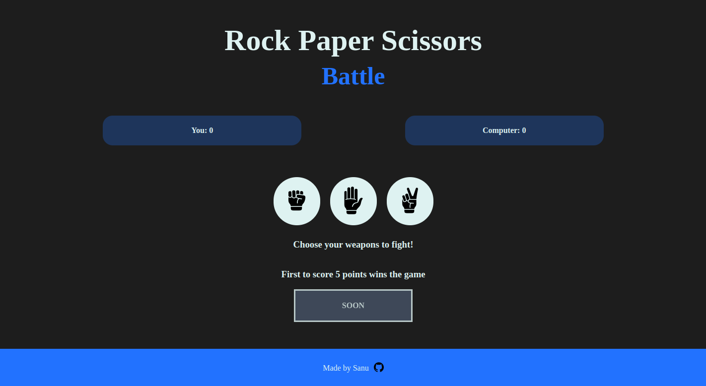

# RPS Battle

Welcome to the Rock, Paper, Scissors Battle game! Compete against the computer and be the first to score 5 points to win the game.

## Live Website

https://idevravn.github.io/RPSBattle/

## Table of Contents

- [Features](#features)
- [Getting Started](#getting-started)
- [Game Rules](#game-rules)
- [Acknowledgments](#acknowledgments)
- [Built With](#built-with)
- [Contributing](#contributing)
- [License](#license)

## Features

- Play Rock, Paper, Scissors against the computer.
- Simple and easy to play.
- Score tracking for both the player and the computer.
- Dynamic updates of user and computer choices.
- Game result announcement when a player reaches 5 points.
- Play Again button to play again easily.

## Getting Started

To view the RPS Battle Website:

1. Clone the repository: `git clone https://github.com/idevRavn/RPSBattle.git`
2. Open `index.html` in your preferred web browser.

## Game Rules

1. Open the [Rock, Paper, Scissors Battle](#) game in your web browser.
2. Click on the Rock, Paper, or Scissors button to make your choice.
3. The computer will randomly choose its option.
4. The round result and updated scores will be displayed.
5. The game ends when either the player or the computer reaches 5 points.
6. Click on Play Again Button to play the game again.

## Acknowledgments

- Images: [Provided by Flaticon](https://www.flaticon.com/)

## Built With

- HTML
- CSS
- JavaScript

## Contributing

Contributions are welcome! If you have ideas for improvement or want to add features, please fork the repository and submit a pull request.

## License

This project is licensed under the [MIT License](LICENSE), allowing for collaboration and sharing.
